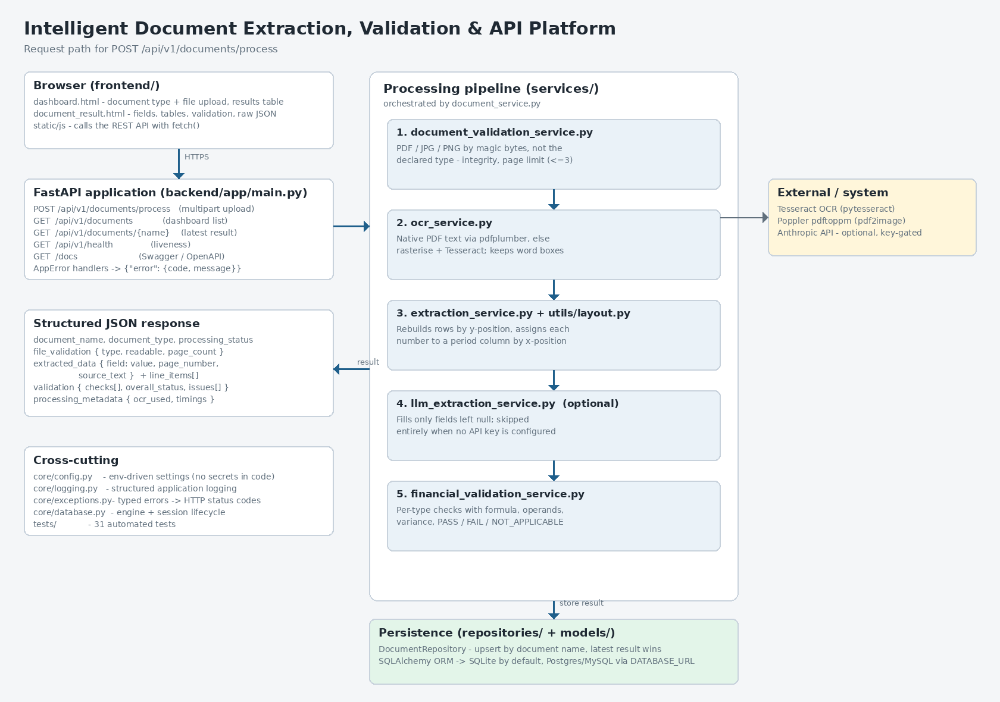

# Intelligent Document Extraction, Validation & API Platform

An end-to-end document intelligence service. It accepts invoices, balance
sheets, profit & loss accounts and cash flow statements as PDF / JPG / PNG,
validates the upload, extracts the fields and tables the document actually
contains, re-computes the financial relationships that should hold, stores the
result, and serves everything through a REST API and a dashboard.



The solution presentation is in [`docs/solution_presentation.pdf`](docs/solution_presentation.pdf)
(also available as `.pptx`), and both it and the diagram above are regenerated
by the scripts alongside them.

## Repository layout

```
backend/       FastAPI application, services, repositories, tests
frontend/      Jinja2 templates and static CSS/JS for the dashboard
docs/          architecture diagram, solution presentation, screenshots
sample_outputs/  real API responses for every required scenario
case_study/    the original brief and the provided sample documents
```

## Deployment URLs

| Item | URL |
| --- | --- |
| Frontend (dashboard) | _add after deploying — same host as the API, path `/`_ |
| Backend API base | _add after deploying_ |
| Swagger / OpenAPI | _API base_ + `/docs` |
| Health endpoint | _API base_ + `/api/v1/health` |
| GitHub repository | https://github.com/Manureddy148/Intelligent-Document-Extraction-Validation-API-Platform |

> The frontend is served by the same FastAPI application as the API, so one
> deployment covers both. See [Deployment](#deployment) for the steps — it needs
> a hosting account, so the URLs above must be filled in after you deploy.

## Contents

- [Solution overview](#solution-overview)
- [Technology choices](#technology-choices)
- [Local setup](#local-setup)
- [Environment variables](#environment-variables)
- [API](#api)
- [Frontend](#frontend)
- [OCR and extraction approach](#ocr-and-extraction-approach)
- [Financial validation rules and tolerance](#financial-validation-rules-and-tolerance)
- [Persistence](#persistence)
- [Deployment](#deployment)
- [Testing](#testing)
- [Measured accuracy](#measured-accuracy-on-the-provided-dataset)
- [Known limitations](#known-limitations)
- [What I would change for production](#what-i-would-change-for-production)
- [AI assistance declaration](#ai-assistance-declaration)

## Solution overview

A single upload flows through five stages, orchestrated by
`document_service.py`:

1. **File validation** (`document_validation_service.py`) — the file type is
   determined from its magic bytes rather than the declared content type, so a
   renamed `.exe` is rejected. Empty files, unreadable/encrypted PDFs and
   documents over the 3-page limit fail with a typed error.
2. **Text + geometry extraction** (`ocr_service.py`) — a PDF with a text layer
   is read directly with `pdfplumber`; otherwise the page is rasterised and run
   through Tesseract. Both paths return words **with bounding boxes**.
3. **Structured extraction** (`extraction_service.py`, `utils/layout.py`) —
   rows are rebuilt from word geometry and each number is assigned to a
   reporting-period column.
4. **Optional LLM recovery** (`llm_extraction_service.py`) — only fills fields
   left null; skipped entirely when no API key is set.
5. **Financial validation** (`financial_validation_service.py`) — recomputes
   the relationships for the document type and reports formula, operands,
   calculated vs reported value, variance and status.

The result is persisted and returned as JSON.

### Processing status

`processing_status` describes whether the **document could be processed**:
`PASS` when meaningful fields were extracted, `FAILED` when the document was
readable but nothing usable came out of it (for example a scan too poor to
recover any key field). Uploads rejected at stage 1 never reach this state —
they return an HTTP error instead.

A financial check that does not reconcile is a *business* outcome, not a
processing failure, so it is reported separately under `validation.overall_status`.
A document can therefore be `processing_status: PASS` with
`validation.overall_status: FAIL` — see
[`sample_outputs/06_invoice_line_items_do_not_match_total.json`](sample_outputs/06_invoice_line_items_do_not_match_total.json),
where the five line items total $3,480 against a printed total of $5,257.

## Technology choices

| Choice | Why |
| --- | --- |
| **FastAPI** | Generates the mandatory Swagger/OpenAPI docs from the code, has first-class multipart upload support, and Pydantic gives typed request/response models for free. |
| **Tesseract** (via `pytesseract`) | Free and self-hosted, so there is no per-page cost, no API key to leak, and no third-party quota to run out of during evaluation. |
| **pdfplumber / pdf2image + Poppler** | `pdfplumber` reads native PDF text *and* word coordinates; the sample statements have no text layer, so Poppler rasterises them for OCR. |
| **SQLAlchemy + SQLite (Postgres in deployment)** | SQLite needs no service to run locally; the same ORM code points at managed Postgres in deployment by changing one environment variable. |
| **Jinja2 + vanilla JS frontend** | The case study asks for HTML/CSS served alongside the Python API; a build step and an SPA framework would add tooling without adding capability. |
| **Rule-based extraction, LLM optional** | The deployed demo works with no API key and produces the same output every run; the LLM path is available where OCR genuinely cannot recover a field. |

## Local setup

Requires **Python 3.10+** and two system packages.

```bash
# System dependencies (Debian/Ubuntu)
sudo apt-get install -y tesseract-ocr poppler-utils
# macOS: brew install tesseract poppler

git clone https://github.com/Manureddy148/Intelligent-Document-Extraction-Validation-API-Platform.git
cd Intelligent-Document-Extraction-Validation-API-Platform

python -m venv backend/.venv
source backend/.venv/bin/activate
pip install -r backend/requirements-dev.txt

cp .env.example backend/.env      # optional; every value has a default

cd backend
uvicorn app.main:app --reload
```

- Dashboard: <http://localhost:8000/>
- Swagger: <http://localhost:8000/docs>
- Health: <http://localhost:8000/api/v1/health>

With Docker instead (system packages already included):

```bash
docker compose up --build       # serves on http://localhost:8000
```

## Environment variables

All settings are read from the environment with the `IDEV_` prefix; nothing is
hardcoded and no secret is committed. Full list in [`.env.example`](.env.example).

| Variable | Default | Purpose |
| --- | --- | --- |
| `IDEV_DATABASE_URL` | `sqlite:///./data/documents.db` | Any SQLAlchemy URL. A managed `postgres://` URL is normalised automatically. |
| `IDEV_MAX_PAGES` | `3` | Page limit enforced before OCR. |
| `IDEV_MAX_UPLOAD_SIZE_MB` | `15` | Upload ceiling. |
| `IDEV_OCR_DPI` | `200` | Rasterisation DPI (see [measured accuracy](#measured-accuracy-on-the-provided-dataset)). |
| `IDEV_OCR_PSM` | `3` | Tesseract page-segmentation mode. |
| `IDEV_FINANCIAL_TOLERANCE_ABSOLUTE` | `1.0` | Absolute arm of the tolerance. |
| `IDEV_FINANCIAL_TOLERANCE_RELATIVE` | `0.01` | Relative arm of the tolerance. |
| `IDEV_LLM_API_KEY` | unset | Enables the optional LLM recovery pass. |
| `IDEV_LLM_MODEL` | `claude-opus-5` | Model used by that pass. |

## API

| Method | Path | Purpose |
| --- | --- | --- |
| `POST` | `/api/v1/documents/process` | Upload and process a document. |
| `GET` | `/api/v1/documents` | List processed documents (dashboard). |
| `GET` | `/api/v1/documents/{document_name}` | Latest stored result for that name. |
| `GET` | `/api/v1/health` | Health check (database + OCR engine reachability). |

Every endpoint declares a Pydantic `response_model`, so `/docs` documents the
full response schema and each controlled error envelope rather than an untyped
object.

### Process a document

```bash
curl -X POST "$API/api/v1/documents/process" \
  -F "file=@balance_sheet.pdf;type=application/pdf" \
  -F "document_type=balance_sheet"
```

`document_type` is one of `invoice`, `balance_sheet`, `profit_and_loss`,
`cash_flow_statement`.

```jsonc
{
  "document_name": "Consolidated Balance Sheet 2017.pdf",
  "document_type": "balance_sheet",
  "processing_status": "PASS",
  "file_validation": { "file_type": "application/pdf", "is_supported": true,
                       "is_readable": true, "page_count": 1, "status": "PASS" },
  "extracted_data": {
    "statement_periods": ["31-Mar-17", "31-Mar-16"],
    "total_assets": {
      "value": { "31-Mar-17": 8923441607.0, "31-Mar-16": 7622123264.0 },
      "page_number": 1,
      "source_text": "Total 8,923,441,607 7,622,123,264"
    },
    "total_equity": { "value": null, "page_number": null, "source_text": null,
                      "note": "Not disclosed as a single line in this statement format..." },
    "line_items": { "capital_and_liabilities": [ /* every row, per period */ ], "assets": [ /* ... */ ] }
  },
  "validation": {
    "checks": [{
      "name": "balance_sheet_equality[31-Mar-17]",
      "formula": "Total Capital & Liabilities ≈ Total Assets",
      "operands": { "total_capital_and_liabilities": 8923441607.0, "total_assets": 8923441607.0 },
      "calculated_value": 8923441607.0, "reported_value": 8923441607.0,
      "variance": 0.0, "status": "PASS"
    }],
    "overall_status": "PASS",
    "issues": []
  },
  "processing_metadata": { "ocr_used": true, "ocr_engine": "tesseract",
                           "extraction_method": "rule_based_layout",
                           "processed_at": "2026-09-10T12:27:00Z",
                           "processing_time_ms": 2840, "pages_processed": 1 }
}
```

Every scalar field carries its `page_number` and the `source_text` row it came
from, so any value can be traced back to the document. Fields the document does
not contain are `null` — never guessed.

### Retrieve and list

```bash
curl "$API/api/v1/documents/Consolidated%20Balance%20Sheet%202017.pdf"
curl "$API/api/v1/documents?limit=20&offset=0"
```

Processing the same document name again replaces the stored result, so
get-by-name always returns the latest. `limit` is bounded to 1–500 and `offset`
to ≥ 0; outside those ranges the API returns 422 rather than attempting the
query.

### Health

```bash
curl "$API/api/v1/health"
```

```json
{ "status": "ok", "app_env": "production", "database": "ok", "ocr_engine": "tesseract 5.3.4" }
```

The check reaches the database with `SELECT 1` and queries the Tesseract binary,
because both are failure modes that a process which started cleanly can still
have. If the database is unreachable it returns **503** with
`"status": "degraded"`, so a platform health probe takes the instance out of
rotation instead of routing traffic to it.

### Errors

Failures return the same envelope with an appropriate status code:

```json
{ "error": { "code": "UNSUPPORTED_FILE_TYPE", "message": "Only PDF / JPG / PNG documents are supported." } }
```

| Code | HTTP |
| --- | --- |
| `UNSUPPORTED_FILE_TYPE` | 415 |
| `EMPTY_FILE`, `CORRUPTED_FILE`, `PAGE_LIMIT_EXCEEDED` | 400 |
| `FILE_TOO_LARGE` | 413 |
| `DOCUMENT_NOT_FOUND` | 404 |
| `EXTRACTION_FAILED` | 422 |
| `INTERNAL_ERROR` | 500 |

| `INVALID_REQUEST` | 422 |
| `NOT_FOUND`, `METHOD_NOT_ALLOWED` | 404 / 405 |

Every failure uses this one envelope, including the framework's own: FastAPI's
request-validation errors and Starlette's 404 for an unrouted path are both
translated, so a client never has to parse a second error shape. Stack traces
are never returned to the caller; they go to the application log.

An uploaded file name is chosen entirely by the caller and becomes a database
key and part of a URL, so it is reduced to a plain base name first:
`../../../etc/passwd` is stored as `passwd`, control characters are removed and
the length is bounded. Non-Latin names are preserved as they are.
Worked examples of every case are in [`sample_outputs/`](sample_outputs/).

## Frontend

Server-rendered Jinja2 templates with plain CSS and vanilla JavaScript, served
by the same FastAPI process as the API — no separate build step or Node
toolchain, and no CORS configuration to get wrong in deployment.

| Page | Path | What it does |
| --- | --- | --- |
| Dashboard | `/` | Document-type selector, PDF/JPG/PNG upload and Process action; table of every processed document with name, type, status and processed time. Search filters by name, type or status. Rows link through to the result. |
| Result | `/documents/{name}` | Extracted key-value pairs, line-item/table rows per period, the financial check table (formula, operands, calculated, reported, variance, status) and a toggle for the raw JSON. |

Missing or unreadable fields are greyed and marked on the result page, and
failing checks are highlighted in the validation table, so an evaluator can see
at a glance what the document did not yield. Both pages read from the deployed
API over `fetch`; the dashboard is backed by the database, so processed results
survive restarts.

Document names come from uploaded file names, so they are attacker-controlled:
every value the pages interpolate is HTML-escaped, and a file named
`.jpg` renders as text rather than executing.

## OCR and extraction approach

**OCR service:** free/self-hosted Tesseract, with Poppler rasterising PDFs that
have no text layer (all of the provided statements). No key, no quota, and no
network call — the pipeline is complete and deterministic without any external
service.

**Optional vision model:** Google **Gemini** (`gemini-flash-latest`, free tier),
enabled by setting `IDEV_GEMINI_API_KEY`. The case study encourages a free-tier
document/OCR service "or equivalent" and permits "any LLM/model available to the
participant"; Gemini was chosen over Cloud Vision because Cloud Vision returns
raw text and boxes — the same thing Tesseract already provides — whereas the
binding problem here is *reading a degraded scan at all*. On the 2022 statements
Tesseract drops entire row labels, and no parser can recover a row that is not
in the text. Gemini is shown the rendered page and asked only for the fields
still null after the deterministic pass, so it fills gaps rather than replacing
anything already grounded in a source row.

The guarantees are unchanged when it runs: a value the deterministic parser
grounded is never overwritten; every recovered value must come back with the
source line it was read from, and is discarded if it does not; and the model is
instructed to return null rather than guess. Recovered values are marked
`"extraction_method": "llm_assisted"` so an evaluator can see exactly which
figures came from where. If the model is unavailable, rate-limited or slow, the
document still returns its deterministic result — the call is retried with
backoff, falls back to other models, and on failure is simply skipped.

An Anthropic text-only path (`IDEV_LLM_API_KEY`) is retained as an alternative.
Neither key is committed; both are read from the environment.

**Pages that were photographed sideways.** A rotated scan is the one failure
Tesseract does not announce: it returns confident-looking nonsense
(`09°0 9£°€ZS Ore 18301 unduly`) rather than an error, and counting letters
cannot tell that apart from text. So page quality is scored as readable words ×
mean OCR confidence, and a page that scores poorly is re-read at other
orientations, keeping one only if it measurably reads better. Tesseract's own
orientation detection is used as a hint rather than an answer — it reports low
confidence (7.6 of 100) on exactly these pages. One dataset invoice goes from 33
rows of mirrored nonsense to 71 readable rows this way. Orientation is decided
on a downscaled copy, so the probe is cheap and a page that reads well the first
time never enters this path.

**Why the extractor is layout-aware.** Reading OCR output line by line loses the
table structure, and two failure modes follow directly from that:

- A row populated for only one year (`Total    743,732,155`) gives no clue
  *which* year the number belongs to. Positionally it is the second column, but
  a text parser sees a single value and attributes it to the first period.
- Tesseract's default page segmentation frequently emits all the labels as one
  block and all the numbers as another, so labels and values are separated
  entirely in the text stream.

So the pipeline keeps the word bounding boxes from both `pdfplumber` and
Tesseract, and then:

1. groups words into rows by vertical overlap (re-uniting labels with values no
   matter what order OCR emitted them in);
2. finds the value columns by clustering the **right edges** of numeric tokens
   (financial tables are right-aligned), preferring the best-supported and
   rightmost clusters;
3. assigns each number to the nearest column, which puts a lone value in its own
   period and drops schedule/note reference numbers that sit outside the value
   columns;
4. walks rows in order tracking the current section (`CAPITAL AND LIABILITIES`,
   `ASSETS`, `INCOME`, …). A row carrying values is always a line item, never a
   heading — otherwise labels such as "Other income" get swallowed by the
   `INCOME` heading pattern.

Every labelled row is returned under `extracted_data.line_items`, not just the
named minimum fields, so nothing visible in the table is dropped.

**Optional LLM pass.** If `IDEV_LLM_API_KEY` is set, fields still null after the
deterministic pass are sent — with the OCR text — to the Claude Messages API
using a JSON-schema structured output. It is instructed to copy values verbatim
and return `null` rather than guess, it can only *fill* nulls (never overwrite a
grounded value), and any failure falls back silently to the deterministic
result. Values it supplies are marked `"extraction_method": "llm_assisted"`.

## Financial validation rules and tolerance

A check passes when `|calculated − reported|` is within
`max(1.0, 1% × max(|calculated|, |reported|))`. The relative arm matters because
the statements report figures in thousands/crore where a rounded last digit is
normal; the absolute arm keeps small invoice amounts sensible.

If any value a check needs is missing, the check is `NOT_APPLICABLE` — never a
failure. Summing a section whose rows were not all read would treat an unread
row as zero, so those reconciliations are also `NOT_APPLICABLE` rather than
reporting a discrepancy the document does not support.

| Document | Checks |
| --- | --- |
| **Invoice** | `quantity × unit_price ≈ line amount` per line item; `Σ line amounts ≈ subtotal` (or total); `subtotal + tax − discount ≈ total`; where tax is included in the printed total, the tax-inclusive variant is checked instead; `cash_paid − total ≈ change`. |
| **Balance sheet** | `Total Capital & Liabilities ≈ Total Assets`; `Σ capital & liability rows ≈ reported total`; `Σ asset rows ≈ reported total`. |
| **Profit & loss** | `Interest Earned + Other Income ≈ Total Income`; `Interest Expended + Operating Expenses + Provisions ≈ Total Expenditure`; `Total Income − Total Expenditure ≈ Net Profit`; `Net Profit − Minority Interest + Share of Associates ≈ Profit attributable to the Group`; `Current Profit + Brought Forward ≈ Total Available for Appropriation`. |
| **Cash flow** | `Operating + Investing + Financing + FX ≈ Net Increase in Cash`; `Opening + Net Increase + Amalgamation adjustments ≈ Closing Cash`. |

Bracketed figures are parsed as negatives, and every check runs **once per
reporting period** present in the document.

## Persistence

`ProcessedDocument` stores the document name (unique), type, status, the full
result JSON and timestamps. `DocumentRepository` upserts by name, so
reprocessing replaces the previous result and get-by-name returns the latest;
the dashboard list is served from the same table ordered by last update.

SQLite by default; set `IDEV_DATABASE_URL` to a Postgres/MySQL URL for
deployment — no code change, and `postgres://` URLs from managed providers are
rewritten to the driver form SQLAlchemy 2 expects.

**Use Postgres for a deployment, not SQLite.** The case study allows either
("SQLite, PostgreSQL, MySQL or an equivalent option") but requires that
processed results "remain available during evaluation", and free instances on
Render and Cloud Run have ephemeral filesystems — a SQLite file is lost on every
restart and redeploy. `render.yaml` provisions Postgres and wires
`IDEV_DATABASE_URL` to it automatically.

The Postgres path was verified against a real PostgreSQL 16 server rather than
assumed, using the `postgres://` URL form Render hands out:

| Check | Result |
| --- | --- |
| Schema created on first start | `processed_documents` table created automatically |
| All four document types processed | every one `PASS`, validation `PASS` |
| Health endpoint | reports `"database": "ok"` |
| Non-Latin document names | `发票🧾.jpg` stored and retrieved intact |
| Upsert by name | the same name uploaded three times leaves one row |
| Full JSON round-trip | per-period values, evidence and all checks returned unchanged |
| **Survives a restart** | a fresh instance with no shared filesystem still listed every document and returned complete results |
| 17 concurrent uploads | all `200`, no deadlocks, one row for the contended name |

## Deployment

Both frontend and API are one FastAPI app, so a single service covers both.
The OCR path needs `tesseract-ocr` and `poppler-utils`, so deploy the
**Docker** image rather than a plain Python runtime.

**Render (blueprint included):** push the repo, then *New → Blueprint* and pick
it up — [`render.yaml`](render.yaml) provisions the web service from
`backend/Dockerfile`, attaches a free Postgres instance, and sets
`/api/v1/health` as the health check. Set `IDEV_LLM_API_KEY` in the dashboard
only if you want the optional LLM pass.

**Railway / Koyeb / Fly:** point the service at `backend/Dockerfile` with the
repository root as build context, expose `$PORT`, and set `IDEV_DATABASE_URL`.

```bash
# The image, verbatim, as deployed:
docker build -f backend/Dockerfile -t doc-intelligence .
docker run -p 8000:8000 -e IDEV_DATABASE_URL=sqlite:///./data/documents.db doc-intelligence
```

A [`Procfile`](Procfile) and [`Aptfile`](Aptfile) are included for
buildpack-based platforms. Note that a free instance's filesystem is ephemeral —
use the managed database so processed results survive a restart.

### Render (no billing account required)

1. **New → Blueprint**, point it at this repository, **Apply**. `render.yaml`
   defines the web service and a Postgres database; the Docker runtime is used
   because the OCR path needs `tesseract-ocr` and `poppler-utils`, which a plain
   Python runtime does not provide.
2. Render prompts for the two keys marked `sync: false`. Set
   **`IDEV_GEMINI_API_KEY`** — without it the deployment runs the deterministic
   path only, which reconciles 230 checks instead of 282 and leaves two
   documents unreadable. `IDEV_LLM_API_KEY` is optional.
3. The first build takes a few minutes (the image installs Tesseract). When it
   is live, check `/api/v1/health` — it reports whether the database and the OCR
   engine are both reachable, and returns 503 if the database is not.

The frontend needs no separate deployment: the same service serves the dashboard
at `/`, the API under `/api/v1/`, and Swagger at `/docs`.

If the blueprint is rejected because the free Postgres plan is unavailable,
remove the `databases:` block and the `IDEV_DATABASE_URL` entry from
`render.yaml`; the service falls back to SQLite, which works but does not
survive a restart.

### Google Cloud Run

`cloudbuild.yaml` builds the image and deploys it in one step. Cloud Build does
the build, so no local Docker daemon is required.

```bash
gcloud services enable run.googleapis.com cloudbuild.googleapis.com \
                       artifactregistry.googleapis.com
gcloud artifacts repositories create containers \
  --repository-format=docker --location=asia-south1

gcloud builds submit --config cloudbuild.yaml \
  --substitutions=_REGION=asia-south1,_SERVICE=document-intelligence
```

The service is given 2 vCPU and 2Gi: OCR on a scanned page is CPU-bound, and the
optional vision pass waits on a network call, so the 1 vCPU / 512Mi default is
not enough. Set the API key on the service rather than in the image:

```bash
gcloud run services update document-intelligence --region=asia-south1 \
  --update-env-vars=IDEV_GEMINI_API_KEY=...   # or --update-secrets from Secret Manager
```

Cloud Run's filesystem is ephemeral, so point `IDEV_DATABASE_URL` at Cloud SQL
(or any managed Postgres) for results to survive a restart; the default SQLite
file is fine only for a quick look.

## Testing

```bash
cd backend && pytest            # 94 tests
```

Covering file validation (type sniffing, empty, corrupted, page limit, size
limit), the layout engine (row rebuilding, period detection, lone-value column
assignment, schedule-column rejection, rejoining split figures), invoice
parsing and its refusal to read headings or OCR noise as values, every document
type's financial checks, the LLM pass (disabled, recovery, failure fallback),
the API flow (process → get-by-name → list), error envelopes, the OpenAPI
contract (response models and documented error codes), paging bounds, and the
HTML routes.

[`sample_outputs/`](sample_outputs/) holds real responses produced by this code:
all four document types, a two-page statement, scanned receipts (one that
reconciles, one whose tax line OCR could not read, one whose line items do not
match its printed total), an unreadable scan, the dashboard list, and every
error case.

## Measured accuracy on the provided dataset

Every one of the **50 documents** in the supplied dataset — 30 statements
(2017–2026) and all 20 invoice images — was posted to the running API and the
financial checks counted. A check only passes if the numbers extracted from the
document genuinely add up, so this doubles as an extraction-accuracy measure.

Both configurations were measured over the full dataset — the deterministic
Tesseract pipeline alone, and the same pipeline with the Gemini vision recovery
pass enabled.

**Deterministic only** (no API key, the default):

| Document type | Docs | PASS | FAIL | NOT_APPLICABLE |
| --- | --- | --- | --- | --- |
| Balance sheet | 10 | 45 | 0 | 15 |
| Profit & loss | 10 | 76 | 0 | 24 |
| Cash flow | 10 | 32 | 0 | 8 |
| Invoice | 20 | 29 | 2 | 25 |
| **Total** | **50** | **230** | **2** | **72** |

**With the Gemini vision pass** (`IDEV_GEMINI_API_KEY` set):

| Document type | Docs | PASS | FAIL | NOT_APPLICABLE |
| --- | --- | --- | --- | --- |
| Balance sheet | 10 | 46 | 0 | 14 |
| Profit & loss | 10 | 96 | 0 | 4 |
| Cash flow | 10 | 37 | 0 | 3 |
| Invoice | 20 | 53 | 5 | 27 |
| **Total** | **50** | **282** | **5** | **48** |

The vision pass turns 24 `NOT_APPLICABLE` results into reconciled checks, reads
the invoice item tables the parser cannot, and
all 50 documents reach `processing_status: PASS` — including the two 2022
statements that the deterministic path cannot read at all. The 2022 balance
sheet goes from 4 of 17 fields to 17 of 18, and its components reconcile to the
reported total exactly. Field coverage rises across the invoices too, typically
from 2–8 fields to 10–15. Every statement check that can be evaluated now
passes. Three of the five remaining failures are the genuine document
discrepancies described above; the other two are OCR misreads of a cash or tax
figure, each reported with the source line so they can be checked against the
page. The cost is latency: a median of 11.2 s against 2.1 s, since a document
with missing fields makes one extra call, and an invoice with no parsed items
makes a second to read its table.

The numbers below describe the deterministic path, which is what runs without a
key.

All 50 returned HTTP 200 with no crash; 48 finished `processing_status: PASS`
and 2 (the 2022 statements) `FAILED` because their scans are too poor to yield
any key field. Median processing time 2.1 s; the slowest is 11.8 s, a
12-megapixel photograph that has to be read twice because it was taken sideways
(see [known limitations](#known-limitations)).

Every statement check now reconciles. The `NOT_APPLICABLE` results concentrate
in the 2020–2022 statement scans, where OCR cannot recover the row labels, and
in receipts that print neither a subtotal/tax pair nor a cash/change pair —
there is simply nothing to reconcile.

The two remaining `FAIL`s were each read back against the source image and are
genuine discrepancies in the documents as printed, which is exactly what the
checks exist to surface:

- `batch3-1495.jpg` — the five line items total $3,480 against a printed total
  of $5,257.
- `X51005719883.jpg` — RM 150.00 tendered against a RM 106.50 bill should
  return RM 43.50; the receipt prints RM 41.50.

A `FAIL` is only ever reported when every operand was actually read off the
page. Where a component row is missing the check is `NOT_APPLICABLE` instead —
a figure that was never read is not evidence of a discrepancy, and treating it
as zero would manufacture one.

Every default in the OCR path was chosen by re-running this benchmark rather
than by assumption:

| Change | Result |
| --- | --- |
| Starting point (heading-based sections, colour input) | 132 PASS / 8 FAIL / 60 N/A |
| Sections also open on their first line item, not just a heading | 136 / 8 / 56 |
| Greyscale before OCR | 144 / 11 / 45 |
| Rejoin figures OCR split in half | **148 / 7 / 45** on statements |
| Two-row receipt line items, tax-exclusive/inclusive totals, comma decimals | 209 / 10 / 64 across all 50 documents |
| Line-item sums compared to the subtotal, not a tax-inclusive total | 217 / 16 / 65 |
| Keyword exclusions (`net profit *before* minority interest`), amalgamation operand, two-digit comma decimals | 226 / 3 / 68 |
| Invoice rows read only inside the item table, columns resolved by arithmetic | 228 / 2 / 67 across all 50 documents |
| Re-read a page at another orientation when it reads badly | 230 / 2 / 70 — one invoice went from unreadable to 71 rows |
| Unresolvable item columns report no quantity instead of a wide "discrepancy" | **230 / 2 / 72** across all 50 documents |
| 300 DPI instead of 200 | 215 / 9 / 73 — *rejected*, re-measured against the final extractor |
| Sparse-text page segmentation (PSM 11) instead of PSM 3 | 219 / 11 / 71 — *rejected*, see below |
| Second colour OCR pass unioned with the first | 149 / 7 / 44 for 2× the latency — *rejected* |

PSM 11 is worth describing because it looks like a win and is not. It reads
*more* rows off the poor 2020–2022 scans — the 2022 statements stop failing
outright and yield 7/17 and 10/23 fields — but the extra rows are unreliable, so
the totals they feed no longer reconcile: balance-sheet components summed to
386,955 against a reported 1,799,506, and the P&L read the same figure as both
current and brought-forward profit. Those are **false** `FAIL`s, claiming a
document disagrees with itself when it does not, which is worse than an honest
`NOT_APPLICABLE`. It also halves invoice accuracy (29 → 15 PASS, 2 → 8 FAIL),
since receipts are dense single-column text that full page segmentation handles
better. Setting the mode per document type would recover the cash-flow gain, but
tuning a parameter per type against ten documents each is the over-fitting this
benchmark exists to catch, so PSM 3 stands everywhere.

## Known limitations

- **OCR quality is the binding constraint.** On the 2020–2022 statements
  Tesseract drops entire row labels (`a 135,936.41`, `a) URE`), so those fields
  are reported `null` and their checks `NOT_APPLICABLE`. A commercial OCR
  service (Google Document AI, Textract) or the optional LLM pass is the way to
  close this gap; the deterministic path cannot invent what OCR did not read.
- **Statement parsing is tuned to this dataset's banking format.** Sections are
  recognised by their headings *and* by the line labels that open them, and both
  follow Indian bank statement conventions.
  Other layouts still get every labelled row via `line_items`, but the named
  fields and the per-type checks may come back `NOT_APPLICABLE`.
- **Receipt-style invoices extract fewer fields.** The SROIE images are noisy.
  Across the 20 invoices the extractor finds a vendor name on 19, a date on 15,
  a total on 15, an invoice number on 10, line items on 9 and a customer name on
  5 — most of these receipts simply do not print a buyer, a subtotal or a
  discount. A vendor name is only accepted from the top of the document and only
  when it reads like words, so an unreadable header returns `null` rather than a
  scrap of OCR noise.
- **An unreadable item column reports no quantity.** Invoices order their list
  price, net rate, discount and unit-of-measure columns differently. Where
  quantity × rate lands near the printed amount the row is reported in full and
  a near miss is flagged as a discrepancy; where it does not, the description and
  amount are kept and the quantity and rate come back `null`, because choosing
  between the columns would be inventing a value.
- **Period labels degrade to `period_1`/`period_2`** when the header is too
  damaged to read a date (2024 balance sheet OCRs as `March a1,`). Values are
  still assigned to the correct columns.
- **A misread digit surfaces as a validation FAIL.** That is the check doing its
  job, but it means a FAIL is not proof the source document is wrong.
- **A sideways page costs an extra read.** When a page reads badly the image is
  re-read at another orientation, which recovered one invoice in the dataset
  completely (33 rows of mirrored nonsense became 71 readable rows). Orientation
  is chosen on a downscaled copy so the probe is cheap, but the winning
  orientation still needs a second full-resolution pass: that document takes
  11.8 s against a 2.1 s median. Pages that read well the first time never enter
  this path and are not slowed at all.
- **Processing is synchronous**, roughly 2–6 s per scanned page, dominated by
  Tesseract. Free-tier instances are slower still and cold-start.
- **No authentication.** The API is open, as the case study scope allows.

## What I would change for production

- Move processing to a worker queue (Celery/RQ or a task runner) and return a
  job id, so a slow scan never holds an HTTP connection open.
- Put the uploaded document in object storage (S3/GCS) and keep only a
  reference in the database; today the file is processed and discarded.
- Add authentication/authorisation and per-tenant isolation, plus rate limiting
  on the upload endpoint.
- Add a golden-file regression suite over a labelled corpus so extraction
  accuracy is tracked per change, rather than measured ad hoc as it is here.
- Run a better OCR engine, and treat the LLM pass as standard with cost controls
  and caching rather than an opt-in.
- Ship metrics/tracing (OpenTelemetry) for per-stage latency and validation
  outcomes, alert on the FAIL rate, and add DB migrations (Alembic) instead of
  `create_all`.

## AI assistance declaration

This solution was built with **Claude (Anthropic)** used as a coding assistant
throughout — scaffolding the FastAPI/service layout, drafting the parsing and
validation code, writing tests and this documentation.

The work that determined the outcome was empirical and is reproducible from the
repository: benchmarking all 30 dataset statements to find that the first
extractor was over-fitted to the 2017 layout, diagnosing why lone values landed
in the wrong period column, measuring PSM and DPI settings rather than assuming
them, and tracing the duplicated line-item lookups that made the validator check
different numbers than the extractor reported. Each fix was verified by
re-running that benchmark and the test suite; the accuracy table above is that
measurement, not an estimate.

The optional LLM pass calls Claude at runtime; it is disabled unless an API key
is supplied, and the platform is fully deterministic without it.
